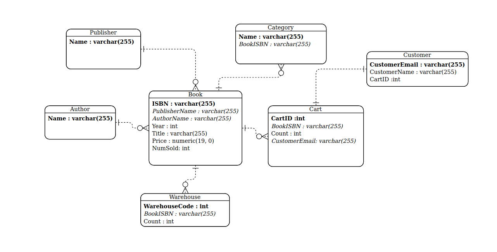

# Online Book Store Project

[](https://travis-ci.org/joemccann/dillinger)

The Online Book Store project is part of Advanced Database Systems class that implements the CRUD, and display functionalities of a SQL database (here SQlite3) through a web app. 

The platforms utilised for this project are as follows: 
  - Django Web Framework
  - SQlite3 Database
  - HTML for formatting the text and implementing functional UI

# Features:
  - Display all books by category
  - Show all books present in the database
  - Add, Delete, Update books (Debugging left)
  - List all books by a author
  - Flexible searching by publisher, title, and isbn 
  
# ERD Diagram:
[Diagram](erd.png)


# Prerequisites:
- Python3.x, pip, and python's venv module

# Building the project locally:
- Create a new venv virtual environment (recommmended method for developing) 
- ```pip install -r requirements.txt``` to install all the required python packages using pip
- Not all commands for table creation and populating the tables is included in queries.sql. Nevertheless, you can import some of the records into
your sqlite server database as ```cat queries.sql | mysqlite3 db.sqlite3``` where ```dbsqlite3``` is the name of the database of this project's database but you can easily repurpose it and connect it to a different database. 

# Running the server:
- ```cd bookStore``` then run ```python3 manage.py runserver``` to start the server
- By default, you can find the webpage being served at ```localhost:8000``` but it can be configured in case it causes any issues for you. 
- Django admin dashboard can be accessed at ```localhost:8000/admin```. 

# Project Structure:
- bookApp application is present within the bookStore project and utilises most of the common components generated when setting up Django project for the firtst time. 
- queries.sql is included to show what some of the quereies look like to populate the database
- HTML templates are present in the templates directory under the app's root folder. 

### ToDos

- [X] Design the ER diagram;
- [X] Books should be under different categories such as computer science, biology, novel, etc.
- [X] Write the commands for creating tables and inserting values;
- [X] Show the tables with the contents that you have inserted;
- [X] Add books, delete books, update books.
- [X] List all of the books for a given author;
- [X] Books are searchable via ISBN, title, author name, publisher, etc;
- [ ] Books can be added to a shoppinng cart; Can be checked out or saved;
- [X] Warehouse quantities need to be updated automatically; if there are only 5 books left in the warehouse, an alert should be trigged;
- [X] Give some statistics such as the top saled books, average saled book, etc.
- [ ] Implement shopping cart

